Write-up for Hack The Box Machine: Papers

HACK THE BOX MACHINE: PAPERS - 10.10.11.143

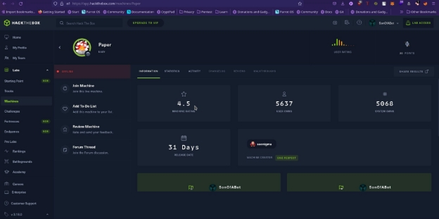

2. Objective

The objective of this assessment is to gaining access to th machine, get user.txt flag, root.txt flag and a root shell

3. Requirements

The student will be required to fill out this penetration testing report fully and to include the following sections:

- Overall High-Level Summary 
- Methodology walkthrough and detailed outline of steps taken
- Each finding with included screenshots, walkthrough, sample code, user.txt and root.txt .
- Any additional items that were not included
0. Report  – High-Level Summary

Nafiu Abdulmalik was tasked with getting access, escalating privilege and getting flags from the machine “ 10.10.11.143”

During the testing, Abdulmalik had no access to the system only the machine IP, thanks to series of enumeration the system was successfully exploited and access granted .  Abdulmalik ’s  overall  objective  was  to  evaluate  the  network,  identify systems, and exploit flaws while reporting the findings back to TOKO & MunX. 

When performing the emumeration, there were several alarming vulnerabilities that were identified on Paper’s network. When performing the attack, Abdulmalik was able to gain access to a machine, primarily due to vulnerebility in old wordpress version 5.2.3 These system files as well as a brief description on how access was obtained are listed below:

- Initial access – Got in through SSH after viewing login credentials from chatbot
- Privilege Escalation – Got in through Polkit 0.105-26 0.117-2 - Local Privilege Escalation due to outdated sudo version
1. Report - Recommendations

Abdulmalik recommends patching the vulnerabilities identified during the testing to ensure that an attacker cannot exploit these systems in the future. One thing to remember is that these systems require frequent patching and once patched, should remain on a regular patch program to protect additional vulnerabilities that are discovered at a later date.

0. Report  – Methodologies

Abdulmalik  utilized  a  widely  adopted  approach  to  performing  Enumerationon targets. Below is a breakout of how Abdulmalik was able to identify and exploit the variety of systems and includes all individual vulnerabilities found.

1. Report  – Information Gathering

The information gathering portion of a penetration test focuses on identifying the scope of the penetration test. During this penetration test, Abdulmalik was tasked with exploiting the lab and exam network. The specific IP addresses were:

Lab Network 10.10.11.143 

2. Report – Service Enumeration

The  service  enumeration  portion  of  a  penetration  test  focuses  on  gathering information about what services are alive on a system or systems. This is valuable for an attacker as it provides detailed information on potential attack vectors into a system. Understanding what applications are running on the system gives an attacker needed information before performing the actual penetration test.  In some cases, some ports may not be listed.

Server IP Address Ports Open

10.10.11.143 TCP: 22,80,443
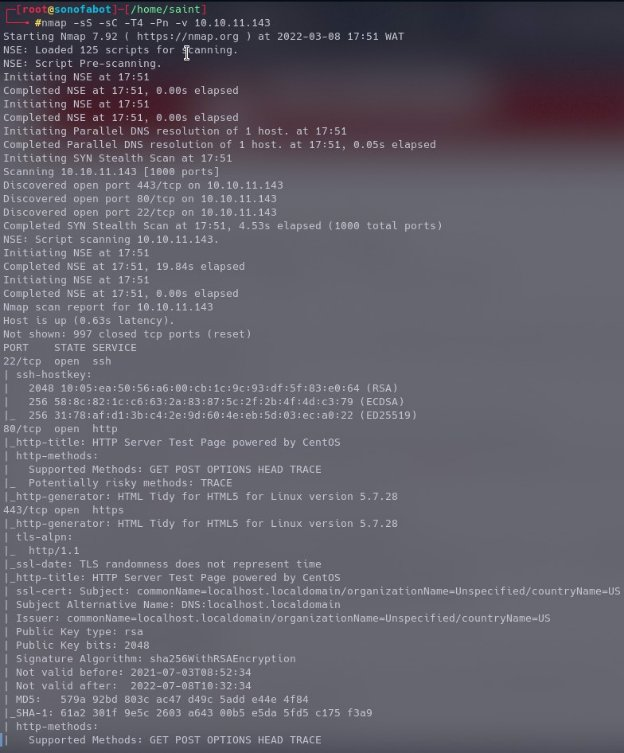

We connected to ip at port 80&443 ended up with default page so no much help

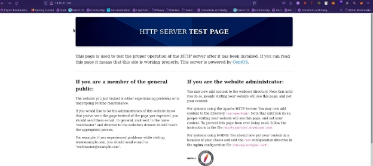

so it seems we won’t be getting much from our browser then lets try to get the packet in burpsuite, send the captured packets to the repeater and see if we can get anything of use:

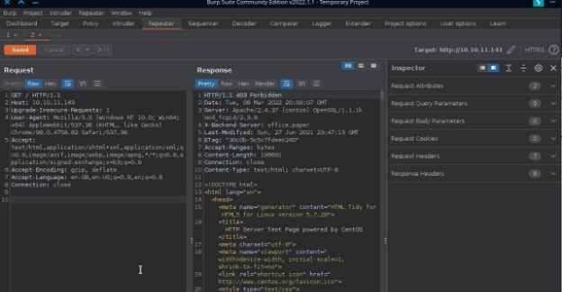

` `Taking a look at the response we notice some backend server

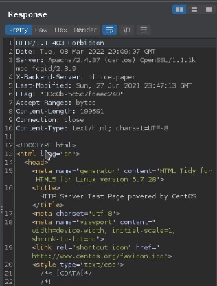

Lets add that to out hosts 

Now head to the url and see what we get

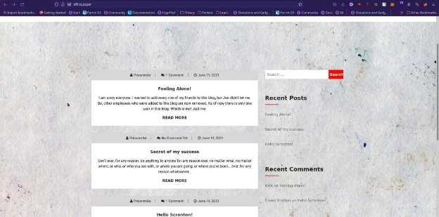

So now we got some sort of site, I ran another nmap scan to scan for vulnerabilities and versions

………………………………………………………………………………………

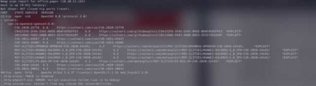

We got an alarming amount of vulnerabilities …………………………………………………………………………………………………….

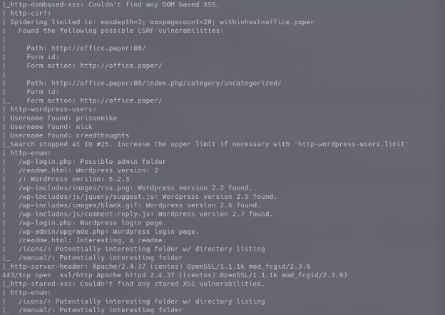

we got to know port 80 was running wordpress CMS of wordpress version 5.2.3 and a bunch of users.

3. Report – Penetration

The penetration testing portions of the assessment focus heavily on gaining access to a variety of systems. During this penetration test, Abdulmalik was able to successfully gain access to 10 out of the 50 systems.

Vulnerability Exploited: WordPress Core < 5.2.3 - Viewing Unauthenticated/ Password/Private Posts

CVE-2019-17671

System Vulnerable: office.paper [10.10.11.143]

Vulnerability Explanation: CVE-2019-17671  So far we know that adding `? static=1` to a wordpress URL should leak its secret content

So far we know that adding `?static=1` to a wordpress URL should leak its secret content

Here are a few ways to manipulate the returned entries:

- `order` with `asc` or `desc`
- `orderby`
- `m` with `m=YYYY`, `m=YYYYMM` or `m=YYYYMMDD` date format

In this case, simply reversing the order of the returned elements suffices and `http://wordpress.local/?static=1&order=asc` will show the secret content:

Vulnerability fix : Update wordpress plugins

Screenshot Here:

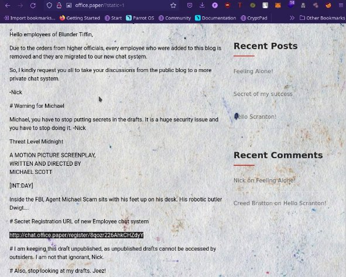

This gives us access to onpublished drafts.

So we head to the link seen after adding it to our hosts files at / etc/ hosts

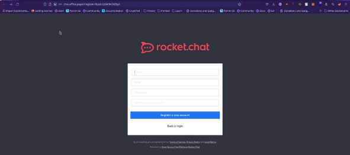

We create an account wait for a minute we notice a general chat.

After going through the chat we find out there’s a bot created by dwayne, then we create a private chat with the bot. 

Screenshot is below.

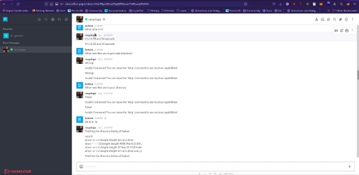We go through the directories I notice that a folder has the name of the bot, it must be its source code. In this folder we find a file ".env". This kind of folder contains environment variables and possibly crendential.

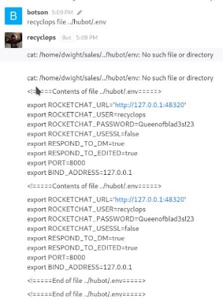We try logging in via ssh with PASSWORD Queenofblad3s!23 with user dwayne

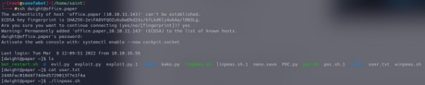

listing files in the directories we notice our user.txt and linpeas.sh is already on the system, we print out our user.txt.

we give linpeas.sh execution permission “chmod +x linpeas.sh” we run the file ./linpeas.sh

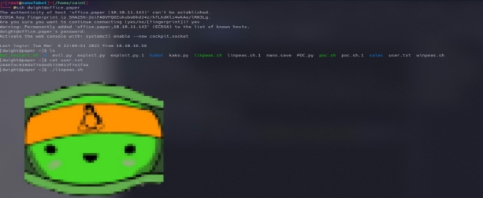

Vulnerability Exploited: Polkit 0.105-26 0.117-2 - Local Privilege Escalation

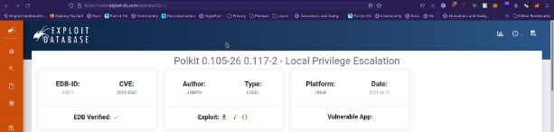

` `System Vulnerable: office.paper

Vulnerability Explanation : CVE-2021-3560 It was found that polkit could be tricked into bypassing the credential checks for D-Bus requests, elevating the privileges of the requestor to the root user. This flaw could be used by an unprivileged local attacker to, for example, create a new local administrator. The highest threat from this  vulnerability  is  to  data  confidentiality  and  integrity  as  well  as  system availability. 

Severity:  HIGH

Proof of Concept Code Here:

--snip--

- Set the name and display name

userName="hacked"

realName="hacked"

- Set the account as an administrator

accountType=1 

- Set the password hash for 'password' and password hint password='$5$WR3c6uwMGQZ/JEZw$OlBVzagNJswkWrKRSuoh/

VCrZv183QpZL7sAeskcoTB' passHint="password"

--snip--

echo ""

echo "[\*] Run 'su - $userName', followed by 'sudo su' to gain root access" …….snip…..

we copy the code and paste it to our machine “nano shelly.sh” grant it execution permisssion

Run su – hacked

password = “password”

Screenshot Here:

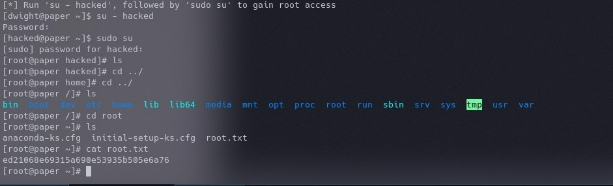

boom root

4. Report  – Advice to help secure host better

To patch this host I think it would be necessary to perform a number of actions a few would be:

- Updating wordpress plugins
- Restrict access to the bot
- Do not leave credentials in an accessible file
- Upgrading linux constantly to avoid old CVEs

   
[Back To Home](../../../../index.md)
 
